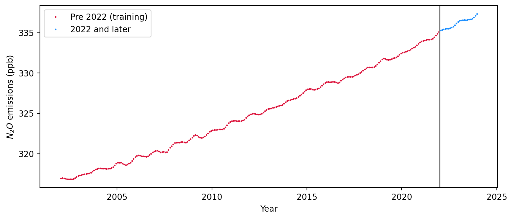
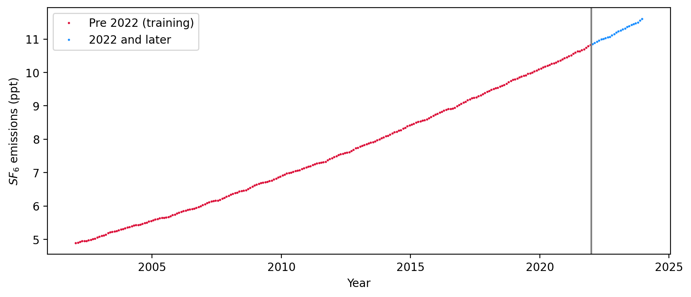
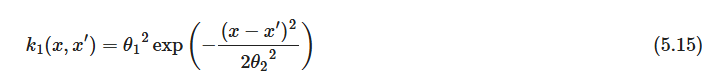
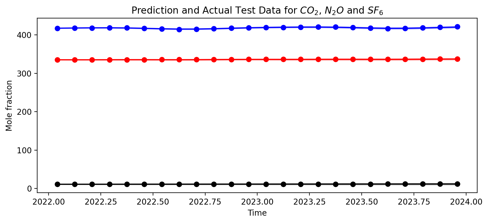
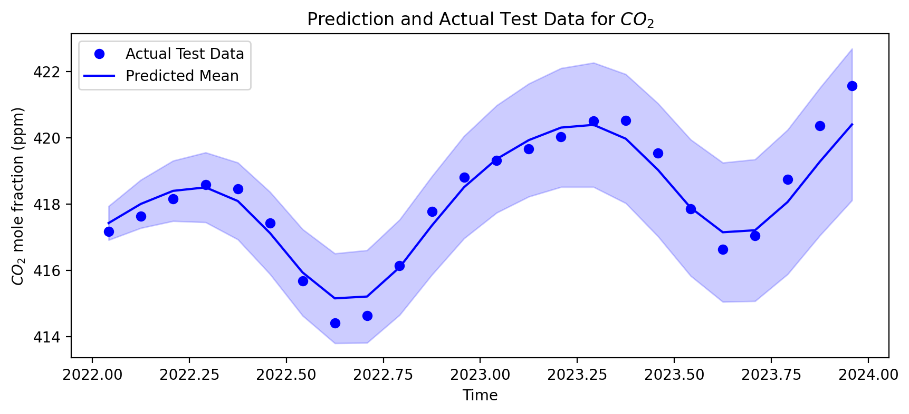
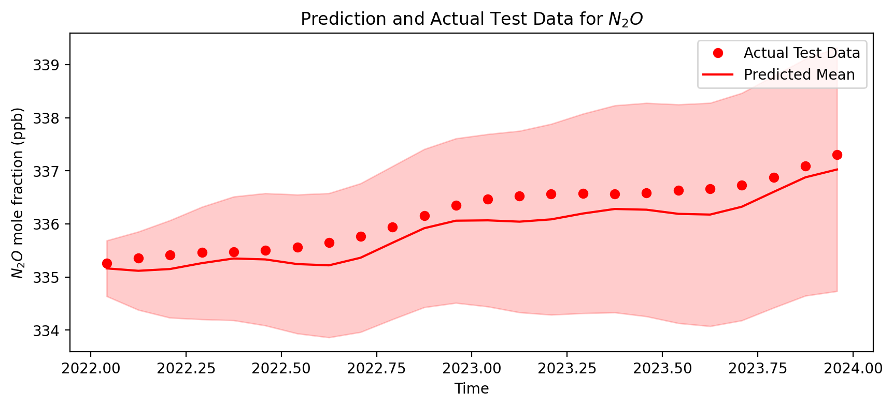
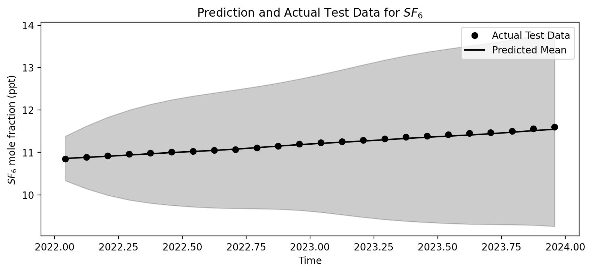

# Multi-Task Gaussian Process Modelling for Air Quality Prediction

Code: [AirQuality_GP](AirQuality_GP.ipynb)

The aim of the project is to design a multi-task gaussian process model to be make predictions of the concentrations of the global $CO_{2}$, $N_{2}O$ and $SF_{6}$ concentrations. The data of concentrations from the year 2002 to 2022 is being used as the training set and the data from 2022 to 2023 forms the test set. 

## Building the GP Model
Building the GP Model constitutes defining the kernels and the posterior. We will be using the kernels defined by Rassmussen in his textbook to make our kernels.
### Defining the Kernel
From the data trend, we observe that there is a gentle increasing trend in the data points. But there is also a local periodic fluctuation throughout the dataset. The period of the fluctuation is one year. Hence, we would need kernels to account for both the increasing and the periodic trends.

With reference from the Rasmussen, we will first use the squared exponential (SE) covariance kernel from equation (5.15) as shown here:

This term will account for the general gradually increasing exponential trend of the dataset.

Now, for the periodic pattern, we will implement the second kernel as defined in equation (5.16) with the sinusoidal component included and a decay term. The period has been set to one year.

$$
k_2(x, x') = {\theta_3}^2\exp\left(- \frac{{(x - x')^2}}{{2{\theta_4}^2}} - \frac{2\sin^2(\pi(x - x'))} {{\theta_5}^2}\right) \tag{5.16}
$$

We will also include a third rational quadratic kernel to account for small to medium irregularities within each period using equation (5.17).

$$
k_3(x, x') = {\theta_6}^2\left(1 + \frac{(x - x')^2}{2\theta_8{\theta_7}^2}\right)^{-\theta_8} \tag{5.17}
$$

$\theta_1$, $\theta_2$, $\theta_3$, $\theta_4$, $\theta_5$, $\theta_6$, $\theta_7$, $\theta_8$ are hyperparameters to be optimized.
### Kronecker Product Kernel
The Kronecker product is taken to integrate the correlations between different dimensions of the data (specified by C) with the relationships captured by the combined kernel function (combined_kernel: K). This allows for a comprehensive modeling of the data structure and relationships, incorporating both the intrinsic data relationships and any specified correlations between dimensions.

$$
C \otimes K = 
\begin{bmatrix}
c_{11}K & c_{12}K & c_{13}K \\
c_{21}K & c_{22}K & c_{23}K \\
c_{31}K & c_{32}K & c_{33}K \\
\end{bmatrix}
$$

The covariance matrix C is a symmetric matrix where the diagonal terms are 1 but the rest of the terms represent the correlation between the 3 datasets that we are training our model on. We take the kronecker product of this C matrix with the kernel from the combined_kernel function to obtain the overall kernel. 

### Defining Posterior
We will be building the posterior with the assumption that the training data has noise. By definition, the training and test data is again a GP which can be partitioned as follows:

$$
\left[\begin{array}{c}
\mathbf{X_{train}}\\
\mathbf{X_{test}}
\end{array}\right]\sim\mathcal{N}\left( 0, \begin{bmatrix}
\mathbf{C_{y}} & \mathbf{R}\\
\mathbf{R}^{T} & \mathbf{C^{*}}
\end{bmatrix}\right)
$$

where $C_{y} = C + {\sigma_y}^2 I_N$ is the covariance matrix on the training data, and $\sigma_y$ is the noise term associated with the training data. $R$ is the cross covariance matrx on training and test data, and $C^{*}$ is the covariance matrix on the test data. 

We will then use these matrices to calculate the mean and covariance as follows:

$$
\mu_s = R^{T}{C_{y}}^{-1}t \\
cov_s = C^{*} - R^{T}C^{-1}R
$$

where $t$ is the observed training output.

## Hyperparameter Optimzation
We will be using maximum log likelihood to do the hyperparameter inference. The log likelihood is as given in equation 5.8 in the Rasmussen textbook.

$$
\log p(\mathbf{y}|\mathbf{X},\theta) = -\frac{1}{2}\mathbf{y}^TK_y^{-1}\mathbf{y} - \frac{1}{2}\log|K_y| - \frac{n}{2}\log 2\pi,
\tag{5.8}
$$

To set the hyperparameters by maximizing the marginal likelihood, we seek the partial derivatives of the marginal likelihood w.r.t. the hyperparameters. From Rasmussen textbook, chapter 5, equation 5.9:

$$
\frac{\partial}{\partial\theta_j}\log p(\mathbf{y}|\mathbf{X},\theta) = \frac{1}{2}\mathbf{y}^TK^{-1}\frac{\partial K}{\partial\theta_j}K^{-1}\mathbf{y} - \frac{1}{2}\text{tr}\left(K^{-1}\frac{\partial K}{\partial\theta_j}\right)
= \frac{1}{2}\text{tr}\left((\boldsymbol{\alpha\alpha}^T - K^{-1})\frac{\partial K}{\partial\theta_j}\right) \quad \text{where} \quad \boldsymbol{\alpha} = K^{-1}\mathbf{y}. \tag{5.9}
$$

For the purposes of this project, we will be passing the log likelihood into the scipy.optimize.minimize to run an in-built gradient optimization and return the optimized hyperparameters.

## Results
As seen in the plots below, the prediction follows the trends of the test data very well. Despite the scale difference and the slightly different trend patterns, the GP model is able to cpature the trendline characteristics of each of the three pollutants very well.

## Conclusion
This project shows the application of a multi-task GP model for the task of prediction. We are able to use a single input (year) to generate multiple outputs (three different pollutant concentrations). GP models are very effective in running such predictions where there is a clear covariance between the different inputs. However, the limitation is that the model may not do well in instances where there is no clear correlation between the input and output. In such cases, different learning techniques would need to be used to draw proper conclusions regarding the trends in the dataset.
