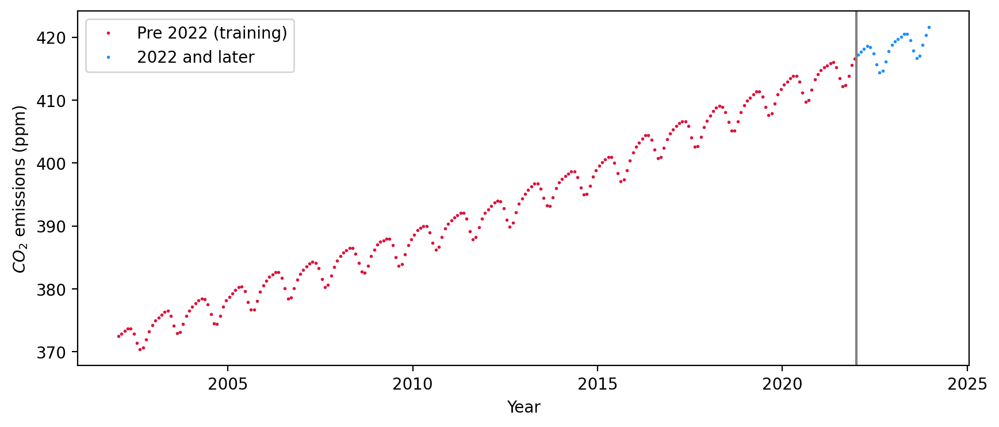

# Multi-Task Gaussian Process Modelling for Air Quality Prediction
The aim of the project is to design a multi-task gaussian process model to be make predictions of the concentrations of the global $CO_{2}$, $N_{2}O$ and $SF_{6}$ concentrations. The data of concentrations from the year 2002 to 2022 is being used as the training set and the data from 2022 to 2023 forms the test set. 

## Building the GP Model
Building the GP Model constitutes defining the kernels and the posterior. We will be using the kernels defined by Rassmussen in his textbook to make our kernels.
### Defining the Kernel
From the data trend, we observe that there is a gentle increasing trend in the data points. But there is also a local periodic fluctuation throughout the dataset. The period of the fluctuation is one year. Hence, we would need kernels to account for both the increasing and the periodic trends.

With reference from the Rasmussen, we will first use the squared exponential (SE) covariance kernel from equation (5.15) as shown here:

$$
k_1(x, x') = {\theta_1}^2\exp\left(- \frac{{(x - x')^2}}{{2{\theta_2}^2}}\right) \tag{5.15}
$$

This term will account for the general gradually increasing exponential trend of the dataset.

Now, for the periodic pattern, we will implement the second kernel as defined in equation (5.16) with the sinusoidal component included and a decay term. The period has been set to one year.

$$
k_2(x, x') = {\theta_3}^2\exp\left(- \frac{{(x - x')^2}}{{2{\theta_4}^2}} - \frac{2\sin^2(\pi(x - x'))} {{\theta_5}^2}\right) \tag{5.16}
$$

We will also include a third rational quadratic kernel to account for small to medium irregularities within each period using equation (5.17).

$$
k_3(x, x') = {\theta_6}^2\left(1 + \frac{(x - x')^2}{2\theta_8{\theta_7}^2}\right)^{-\theta_8} \tag{5.17}
$$

$\theta_1$, $\theta_2$, $\theta_3$, $\theta_4$, $\theta_5$, $\theta_6$, $\theta_7$, $\theta_8$ are hyperparameters to be optimized.
### Kronecker Product Kernel
The Kronecker product is taken to integrate the correlations between different dimensions of the data (specified by C) with the relationships captured by the combined kernel function (combined_kernel: K). This allows for a comprehensive modeling of the data structure and relationships, incorporating both the intrinsic data relationships and any specified correlations between dimensions.

$$
C \otimes K = 
\begin{bmatrix}
c_{11}K & c_{12}K & c_{13}K \\
c_{21}K & c_{22}K & c_{23}K \\
c_{31}K & c_{32}K & c_{33}K \\
\end{bmatrix}
$$

The covariance matrix C is a symmetric matrix where the diagonal terms are 1 but the rest of the terms represent the correlation between the 3 datasets that we are training our model on. We take the kronecker product of this C matrix with the kernel from the combined_kernel function to obtain the overall kernel. 
